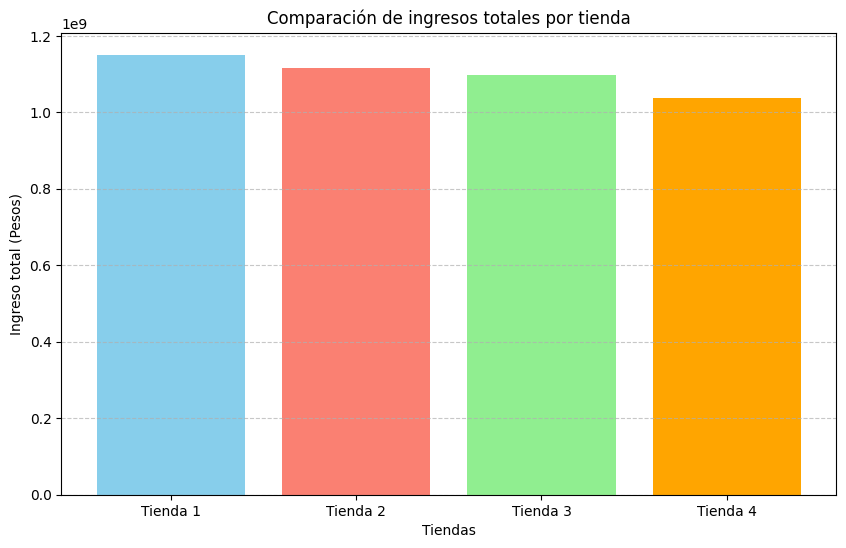
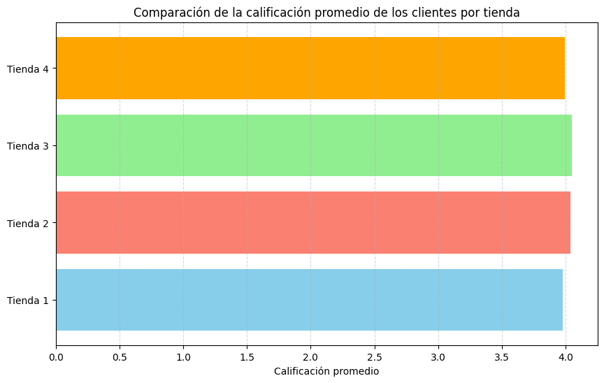
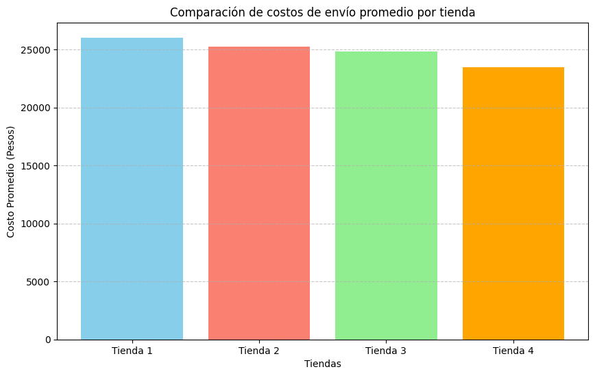

# **Challenge: Alura Store**

## **Descripción del proyecto**

Este proyecto consiste en un análisis exploratorio de datos realizado en Google Colab con el objetivo de evaluar el rendimiento de las tiendas de la cadena Alura Store.

El propósito del análisis es ayudar al propietario de la cadena, a tomar una decisión estratégica: determinar cuál de las tiendas debería vender para financiar un nuevo emprendimiento, basándose en métricas objetivas de desempeño.

El estudio se apoya en indicadores clave de negocio como ingresos totales, categorias mas vendidas, reseñas de los clientes y envio promedio por cada sucursal, con el fin de identificar la tienda menos eficiente.

  

## **Herramientas utilizadas**
- Python.
- Pandas.
- Matplotlib.
- Google Colab.

## **Ejecución del proyecto**
1. Descargar el archivo desde este repositorio.
2. Ingresar a Google Colab.
3. Seleccionar la opción "Subir" y cargar el notebook.
4. Ejecutar las celdas en orden (Entorno de ejecución → Ejecutar todo).

## **Visualizaciones del proyecto**
A continuación se presentan los principales gráficos generados durante el análisis:

### Ingresos totales por tienda

### Categorías más vendidas

### Reseñas de los clientes

### Costo de envío promedio
